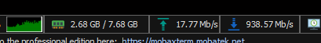

# Tidal Grabber FLACS

Script to grab tidal FLAC urls from lists of song names to download using the squid website

As of now the url script runs synchronously, so it will take some time to run. If you can manage to make the script faster and async be my guest and submit a PR. You will need to make sure ratelimits are not hit.

Files are downloaded from Tidal servers in PARALLEL! So your entire downlink is utilized

## Disclaimer
This tool is intended for personal and educational use ONLY. It is not intended for piracy or the illegal distribution of copyrighted content. You are solely responsible for your actions and for complying with the Terms of Service of any platform you use with this tool. Use at your own risk.

## PreReqs
* Install nodejs
* npm install
* apt install wget parallel
## Part 1: Get ids
* Place song names in names.txt
* Run node index.js

ID's will go in ids.txt

Any failed searches will go in searcherrors.txt, try to rename these songs in order for them to be found.

## Part 2: Get links from squid
* Run node squid.js

url + song name will go in urls.txt

Any errors will result in id being placed into squiderrors.txt, too many request errors automatically result in retrying. Try retrying these ids later.
## Part 3 Mass download FLACs!
* Run bash start.sh

Update start.sh if you want to lower the amount of parallel connections. Default is 50

Files will be automatically downloaded in parallel into ./music

